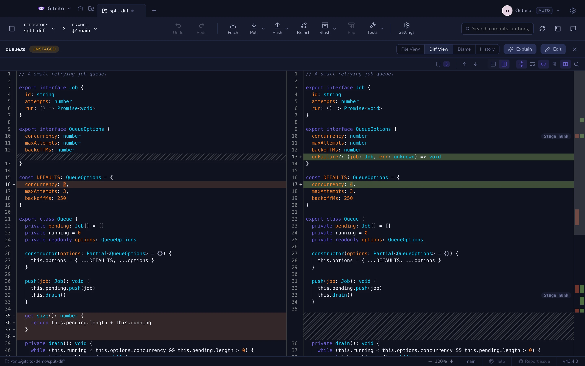
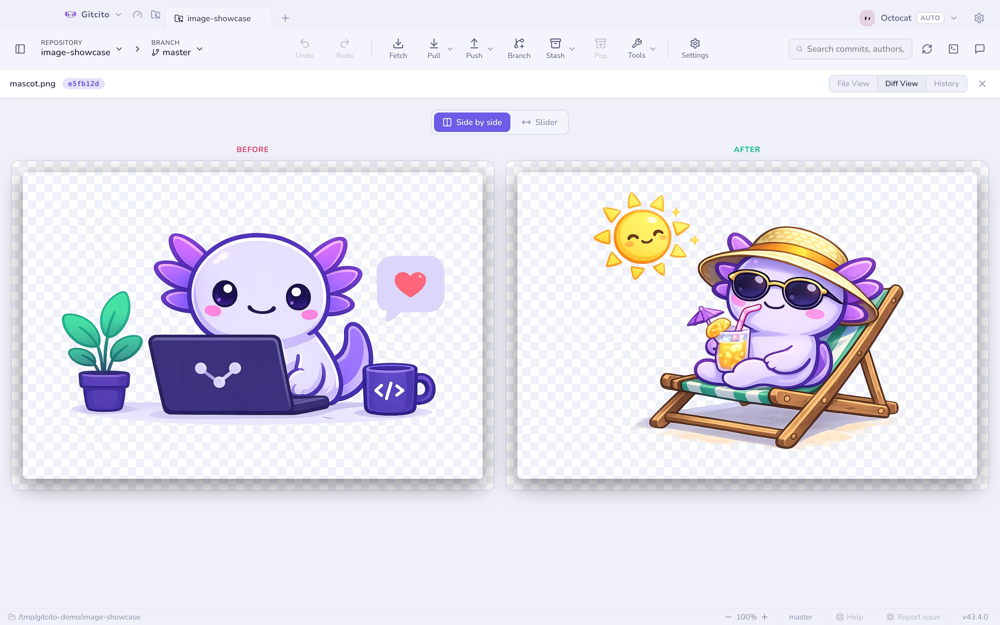

# Diffs & previews

## Reading a diff

The toolbar above every diff is a strip of icons — hover one for its name.

Opening a diff collapses the left sidebar, so the diff gets the width; closing
it brings the sidebar back. If you reopen the sidebar while the diff is up, or
had it closed to begin with, closing the diff leaves it as you set it.

| Control | What it does |
|---|---|
| **{ }** | The [semantic summary](semantic-diff.md): renames, signature changes and moves, symbol by symbol |
| **↑ / ↓** | Jump to the previous or next change |
| **Unified \| split** | Side-by-side when you want to compare, stacked when you want to read |
| **Full file** (split only) | Shows the whole file with each change where it sits; off, only the changed hunks |
| **Wrap** (split only) | Folds long lines inside their column instead of scrolling them |
| **Linked** (split, wrap off) | Scrolls both halves together, vertically and sideways — off, each column scrolls on its own |
| **Ignore whitespace** | Hides reindentation so the real change surfaces |
| **Word-level** | Highlights just the changed tokens inside an edited line — red on the old, green on the new |
| **Find** (<kbd>⌘F</kbd>) | Find inside the diff, with next/previous stepping |

### The split view

A hunk shows three lines either side of a change. That is enough to see *what*
changed but rarely *where*: the function it sits in, the branch it belongs to,
what the rest of the block still does. So split view shows the **whole file**,
old on the left and new on the right, and opens on the first change. Each side
has a margin with its line numbers and a `−` or `+` against every changed line.

- **Bands** mark changed lines — red for removed, green for added — and a
  stronger tone marks the characters that actually differ.
- **Hatching** fills the side that has no line: opposite an insertion on the
  left, opposite a deletion on the right. The two columns always stay row for
  row, so the line facing a hatched stretch is the one that follows it.
- **Indent guides** mark each indentation level, measured in the step the file
  uses (two spaces, four, a tab).
- **The overview ruler** right of the diff is the whole file at a glance: a red
  lane for removed lines, a green lane for added ones, and a box for the part on
  screen. Click or drag anywhere on it to scroll there. It follows the right
  column; with **Linked** on, the left one follows as well.

For a working-tree file a faint **Stage hunk** button sits on the first line of
each hunk, which also works in the full-file view.

With wrap off, a file of any length scrolls at full frame rate: each column
only renders the lines in view and a margin around them, the way a code editor
does. Find, ↑/↓ and opening a line from search all work across the whole file.
The one thing that notices is a mouse selection — it can span a few screens,
not the whole file; to copy a large stretch, use File view.

Full file needs the whole of the new version, so it applies to a single file
opened from a commit, a stash or the working tree. It does not apply to a
multi-file comparison or a snapshot, which show hunks. If that version cannot be
read — it is too large to load, or it no longer matches the diff — the view
falls back to hunks rather than show the wrong file.

Wrap is off by default, so one line stays on one row and the two sides remain
comparable row for row; each half carries its own scrollbars. Turn it on when
you would rather read a long line than chase it — the cost is that a line
folding over three rows on one side no longer sits opposite its counterpart. Every toggle
remembers its state across files and sessions.

With wrap off the two halves scroll **linked** by default — vertically, which
keeps the rows facing each other, and sideways, so column 90 on the left sits
above column 90 on the right. Unlink them when the sides have drifted apart —
an indented block against an unindented one, a rename that shifted every line —
or when you want to compare two distant regions of the same file, and park each
half where its own content is.

The **{ }** button at the start of the toolbar opens the
[semantic summary](semantic-diff.md) — what changed, symbol by symbol, rather
than line by line. Its number is how many declarations changed.

## Image diffs

Changed images get a real comparison: side by side, or a swipe handle to drag
between before and after.

## Change gutter & minimap

The **File view** of a working-tree file — staged or not, tracked or brand new
— carries a colored bar next to every line touched since HEAD (or the index,
for staged files): green for an insertion, blue for a modification, a small
red wedge where lines were removed without replacement. Click a bar to see
that change without leaving the file — the popup shows the removed and added
lines, with next/previous to step through every change in the file.

The **minimap**, off by default, adds a scaled overview of the whole file at
the right edge — click or drag it to jump around, the way a scrollbar would if
it could also show you the shape of the file. Both are per-machine toggles
under **Settings → General → File viewer**.

Neither reads history: switch to Diff, Blame or an older commit and the gutter
disappears — those views already show every change directly.

## Preview anything

The **Preview** mode renders the file instead of showing its source: Markdown,
Word (`.docx`), Excel (`.xlsx`), PDF, video, audio, images, and
syntax-highlighted code for everything else.

### Apple property lists

`Info.plist` and `*.entitlements` are XML, and XML is not what anyone is trying
to read. Preview shows the key/value outline instead — the shape Xcode's own
plist editor shows — with the nesting intact and each value's type beside it.

Two limits. A **binary** plist (`bplist00`) is recognised and named, not decoded
— run `plutil -convert xml1` on it if you want it here, though a binary plist in
a repository is usually a build artefact that should not be committed. And
`<data>` values are shown as a byte count rather than as base64: a blob tells
you nothing, and a provisioning profile rendered into a pane you might be
sharing tells everyone else too much.

### Xcode projects

A `project.pbxproj` is one flat dictionary of objects that point at each other
by id, so reading it in order tells you almost nothing about the project. The
preview walks those references and rebuilds the three things you actually came
for: the **targets** with their build phases, the **group tree** as the Xcode
navigator draws it, and the **build settings** per configuration.

It is a reader, not an editor — nothing here writes to the project. For what
happens when two branches both edit one, see
[resolving conflicts](conflicts.md).

## Very large files

Previews and the file view load a file fully into memory, so both refuse files
past a size cap (32 MB for previews, 16 MB for text) and tell you how big the
file is instead. **Load anyway** overrides the cap for that one file — nothing
is off limits, big loads are just opt-in. Files and diffs past a few thousand
lines still render completely, but rows scrolled out of view are no longer
laid out and painted, so a giant lockfile diff stops costing a laptop's worth
of memory.

## Files tab

The left sidebar's **Files** tab browses the working tree itself, with status
badges on folders (added / modified / deleted) that aggregate what is inside
them.

**See also:** [Semantic diff](semantic-diff.md) · [Staging](staging.md)
