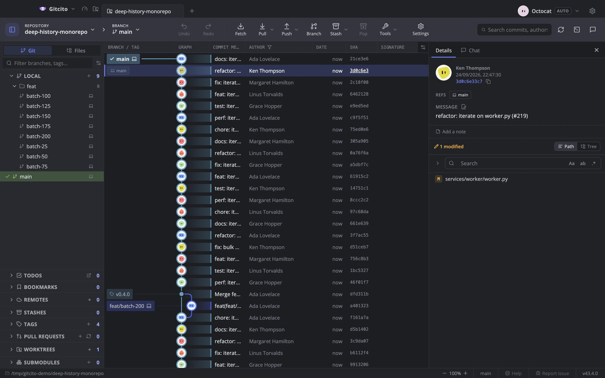

# ערכות נושא ומראה

ערכות נושא מובנות — Gitcito, Nord, Dracula, Solarized, GitHub, Kraken, Monokai,
Midnight, Contrast ו־Daltonic — לכל אחת וריאנט בהיר וכהה.

בחירה ב־**Kraken** מעבירה גם את הגרף לפלטת המסלולים שלה ולתוויות הפניות
**בגוון עדין** — לוחיות כהות בצבע כל מסלול, כמו ש־GitKraken מצייר אותן. זה קורה
פעם אחת, בבחירה: שנו כל אחד מהם אחר כך בהגדרות ← ערכות נושא ← **גרף**
(*תוויות הפניות*: מלאות או גוון עדין) והשינוי נשמר.
הוא גם צובע מסלולים **לכל עמודה** (*צבעי מסלולים*), כך שכל הענפים שרצים באותו
מסלול חולקים צבע אחד במקום שכל אחד יקבל צבע משלו.

Kraken משנה גם את הגופן, לא רק את הצבעים: Open Sans במקום Nunito, טקסט
מודגש יותר, כותרות עמודות ברוחב קבוע על פס בהיר יותר, תוויות refs וכותרות
סרגל צד גדולות יותר וסרגל כלים בהיר יותר. הסגנון הזה שייך לערכת הנושא
עצמה, כך שערכת נושא מותאמת שהועתקה מ־Kraken שומרת רק את הצבעים.
הבחירה גם מעבירה את צבעי הקוד ל־Kraken — ה־Dark+ של VS Code, שבו משתמש
ה־diff של GitKraken — ואת גופן הקוד ל־12px, פעם אחת, כמו הגדרות הגרף.

- **בהיר, כהה, או לפי מערכת ההפעלה**, מוחלף בזמן אמת.
- **ערכות נושא מותאמות אישית**, ו**מחוללות ב־AI** מתוך הנחיה.
- **גודל גופן קוד** ניתן להתאמה.
- **סגנון גרף** נפרד: פלטת המסלולים, סגנון הפינות, צפיפות השורות ועובי הקווים,
  עם תצוגה מקדימה חיה של מיני־גרף.

## פריסה

סרגל צד משמאל או מימין, פאנלים הניתנים לשינוי גודל בכל מקום, סרגל צד מתכווץ למקרה
שהגרף ראוי לכל החלון, ומיקום טרמינל לכל מאגר בנפרד.

**ראו גם:** [גרף הקומיטים](graph.md) · [פרופילים](profiles.md)
