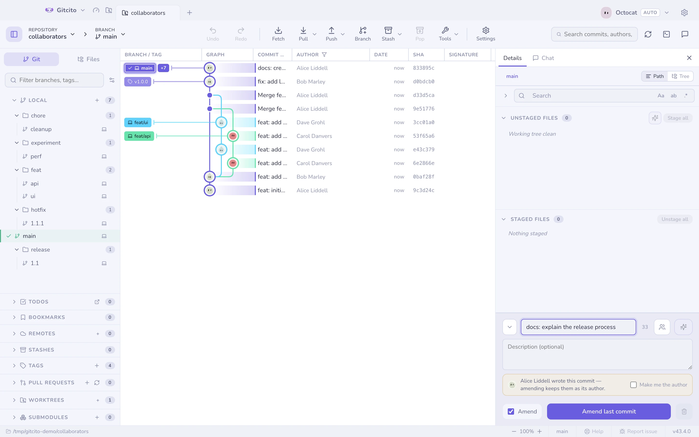

# コミット

## メッセージのスタイル

設定で 1 つ選ぶと、入力欄がそれに合わせて変わります。

| スタイル | 見た目 |
|---|---|
| **Conventional** | `feat(api)!: add rate limiting` — 型を選ぶドロップダウン付き |
| **Gitmoji** | `✨ add rate limiting` — 絵文字ピッカー付き |
| **チケット** | `ABC-123: add rate limiting` — ブランチ名から自動で埋まる |
| **そのまま** · **自動** | 打ったとおり。自動は形を AI に決めさせる |
| **原始人** · **俳句** | 名前のとおりのもの |

## 入力欄がやってくれること

- <kbd>↑</kbd> <kbd>↓</kbd> で**最近のメッセージ**を呼び出せます。
- **共著者ピッカー**が、そのリポジトリ自身の貢献者から `Co-authored-by:`
  トレーラーを追加します。
- `commit.template` / `.gitmessage` がメッセージを**あらかじめ埋め**、コメント行は
  取り除かれます。
- マージ、チェリーピック、リバートの最中は、git と同じようにメッセージが
  **あらかじめ埋まります**。
- 下書きはリポジトリごとに**保持される**ので、タブを切り替えてもメッセージを
  失いません。

## リンター

その場で動く、妨げにならないチェックです。件名の長さ（文字数カウンター付き）、
末尾のピリオド、命令形でない件名や小文字始まりの件名、長すぎる本文の行を見ます。
あくまでヒントであり関門ではありません — コミットを止めることはありません。

## 修正（Amend）

修正は、ステージされているものを使って直前のコミットを書き換えます。Gitcito は
既存のメッセージを先に表示するので、打ち直すのではなく編集することになります。

グラフの行にある **コミットを修正…** は、同じことを HEAD に対して行います。
メッセージ全体を読み込み、入力欄を修正モードに切り替えて、フォーカスを移します。
すでにプッシュ済みの HEAD でも修正はできますが、リモートを更新するには強制
プッシュが必要になると Gitcito が警告します。

### 他人のコミットを修正する

amend は元のコミットの**作成者と作成日時**をそのまま残します — Gitcito ではなく git のルールです。同僚のコミットの誤字を直すならそれで正しいのですが、自分の新しい作業を混ぜ込むと誤りになります。結果は同僚の作としてクレジットされ、グラフには本人が書いていないコードに同僚の名前が表示されます。

そこで HEAD の作成者のメールアドレスが自分の `user.email` と異なる場合、コンポーザーは誰のコミットを修正しようとしているかを示し、**自分を作成者にする** を提示します。チェックすると `--reset-author` 付きで amend し、現在の日時で自分が作成者になります。相手の名前を残すならチェックしないでください。

比較はメールアドレスで行うため、`Elisa` と `elisa` でコミットする同一人物は同じ作成者として扱われます。名前で比較するのはメールアドレスがない場合だけで、リポジトリに ID がまったく設定されていなければ何も表示しません。確認するのは修正対象のコミットだけです。後から cherry-pick や rebase で別の場所へ移したコミットは、その時点の作成者のままです。

amend の後に ⌘Z を押すと修正前のコミットに戻り、新しくステージした変更は amend 前と同じくステージされたまま残ります。そのコミットの親まで戻ることはありません。

**コミットを取り消す…** は、未プッシュの HEAD 向けの対になる操作です。親への
mixed リセットを行い、作業ツリーの変更は保たれ、メッセージは入力欄に復元されます。
最初のコミットには専用の経路があり、ファイルを壊す代わりに未出生（unborn）の
ブランチを残します。

**関連項目:** [ステージング](staging.md) · [アブソーブ](absorb.md) · [変更履歴ジェネレータ](changelog.md)
