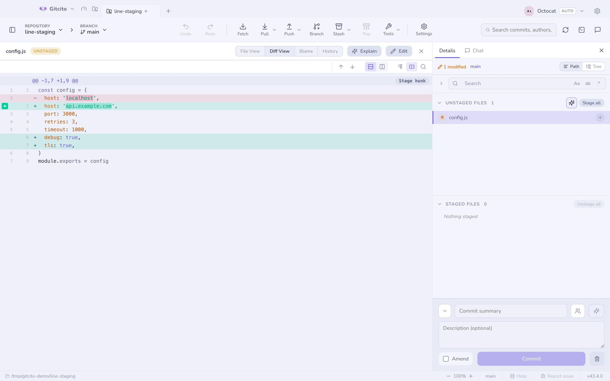

# Przechowalnia

Panel commita ma trzy listy: **W konflikcie**, **Poza przechowalnią**
i **W przechowalni**. Każda się zwija i każda pamięta, w jakim stanie ją
zostawiłeś.

## Trzy poziomy precyzji

| Poziom | Jak |
|---|---|
| **Plik** | Kliknij ✚ w wierszu albo zaznacz kilka wierszy i dodaj je hurtem |
| **Hunk** | Otwórz diff i użyj przycisku w nagłówku hunka |
| **Linia** | Najedź na zmienioną linię w diffie i kliknij jej **+**, albo zaznacz kilka linii i dodaj je |

To dodawanie po liniach sprawia, że da się w praktyce trzymać debugowe
`console.log` poza commitem, nie kasując go wcześniej.

## Dodawanie pojedynczych linii

Otwórz diff pliku spoza indeksu, w widoku zunifikowanym lub dzielonym. Najedź
na dodaną albo usuniętą linię, a na jej początku pojawi się mały zielony **+**:
jedno kliknięcie dodaje do indeksu tę linię i nic więcej. Reszta fragmentu
zostaje poza indeksem — dokładnie tak, jakbyś ręcznie edytował fragment w
`git add -p`.

Żeby dodać kilka linii naraz, klikaj same linie, aby je zaznaczyć —
<kbd>⇧</kbd>-klik bierze wszystkie zmienione linie od ostatnio klikniętej — i
naciśnij **Dodaj do indeksu zaznaczone linie (N)** na pasku nad diffem.

Działa to też w drugą stronę. Otwórz wersję pliku **w indeksie**, a kontrolki
zmienią się w czerwony **−**, **Usuń fragment z indeksu** i **Usuń z indeksu
zaznaczone linie (N)**: wyjmują linie z indeksu i nie ruszają drzewa roboczego.

Gdy zabierzesz ostatnią zmianę ze strony, którą oglądasz, diff podąży za
plikiem na drugą stronę, zamiast zostać pusty.

Każdą linię lub fragment dodany albo usunięty w ten sposób cofniesz przyciskiem
**Cofnij** na pasku narzędzi, jedno kliknięcie na raz.

| Wybierasz | Dodanie do indeksu | Usunięcie z indeksu |
|---|---|---|
| Dodaną linię | Indeks zyskuje tę linię | Indeks traci tę linię |
| Usuniętą linię | Indeks traci tę linię | Linia wraca do indeksu |
| Żadną, w tym samym fragmencie | Zostaje bez zmian, tylko w drzewie roboczym | Zostaje w indeksie |

### Ograniczenia

- **Ukryte białe znaki, bez indeksowania.** Gdy *Białe znaki* są ignorowane,
  diff pomija część zmian i nie wie, które linie dodać; kontrolki znikają, dopóki
  tego nie wyłączysz.
- **Nieśledzone pliki** trafiają do indeksu w całości. Najpierw dodaj plik,
  potem usuń z indeksu linie, których nie chcesz.
- **Ostatnia linia pliku bez końcowego znaku nowej linii** może zostać
  odrzucona, jeśli oddzielisz jej zmianę od linii dodanych po niej — git nie
  potrafi opisać takiego półstanu jako łatki. Dodaj je razem.
- **Cofnięcie wymaga indeksu takiego, jakim go zostawiłeś.** Jeśli od tamtej
  pory dodałeś więcej z tych samych linii, git odmawia cofnięcia zamiast
  zgadywać, i o tym mówi.

## Odrzucanie

Odrzucanie działa na tych samych poziomach i zawsze pyta. Pliki nieśledzone są
kasowane; śledzone wracają do swojego stanu z przechowalni (albo z commita).

## Klawiatura

<kbd>↑</kbd> <kbd>↓</kbd> (albo <kbd>j</kbd> <kbd>k</kbd>) chodzą po listach
plików, <kbd>⇧</kbd> zaznacza zakres, a <kbd>⌘</kbd>/<kbd>Ctrl</kbd> przełącza
pojedyncze pliki.

<kbd>⇧</kbd>+<kbd>↑</kbd>/<kbd>↓</kbd> rozszerza zaznaczenie od ostatnio
klikniętego wiersza. Kliknij zaznaczenie prawym przyciskiem, by za jednym razem
dodać do stage, usunąć ze stage, dodać do stasha albo odrzucić wszystko.

## Kopiowanie ścieżek

Kliknięcie prawym przyciskiem niezacommitowanego pliku daje **Kopiuj ścieżkę
pliku** (bezwzględną, ze znakami separatora platformy) oraz **Kopiuj względną
ścieżkę pliku** (`src/index.ts`, bez wiodącego `./`). Kilka zaznaczonych plików
kopiuje jedną ścieżkę na linię, w kolejności listy. Usunięte pliki pozostają
aktywne — te akcje kopiują tylko tekst. Foldery nadal kopiują ścieżkę folderu.

## Zanim zacommitujesz

Gitcito sprawdza kilka rzeczy i pyta raz, nigdy po cichu:

- plik, który wygląda na **sekret** (`.env`, `*.pem`, `id_rsa`…),
- **bardzo duży** blob (próg w Ustawienia → Bezpieczeństwo),
- commit **prosto na chronioną gałąź** (domyślnie `main`/`master`).

Każde z tych ostrzeżeń oferuje *Ignoruj i przestań śledzić* jednym kliknięciem.
Zobacz [Bezpieczeństwo i sekrety](security.md).

**Zobacz też:** [Commitowanie](committing.md) · [Diffy](diffs.md) · [Absorb](absorb.md)
