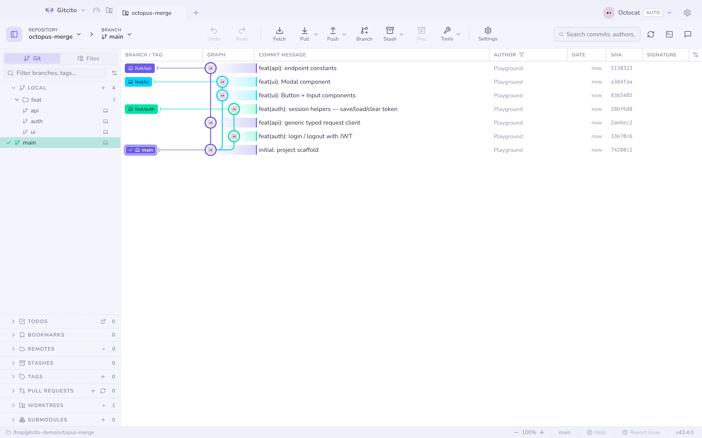
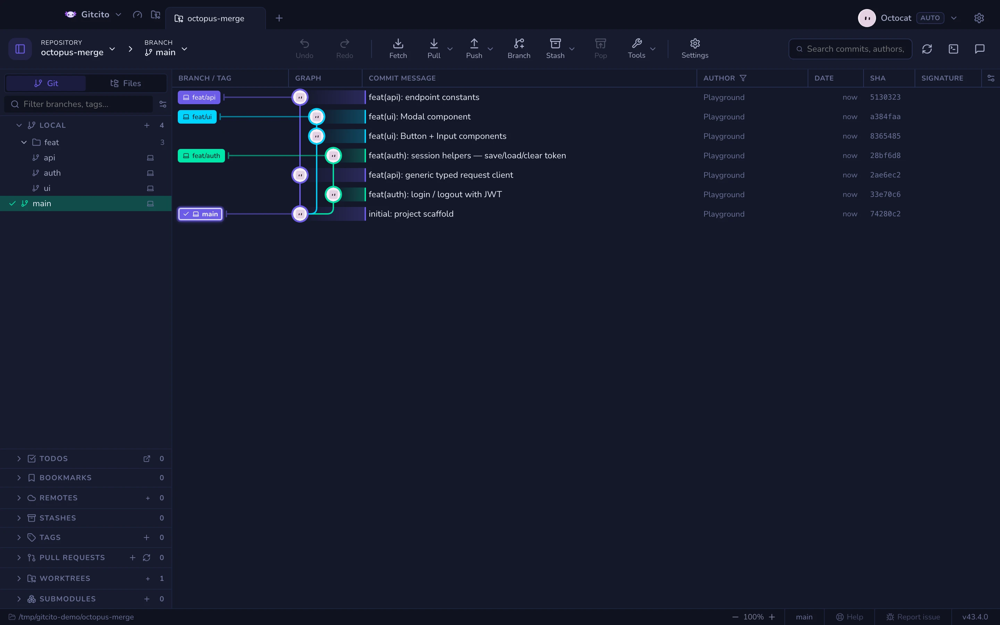
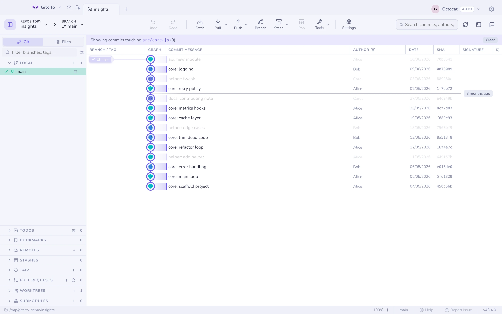
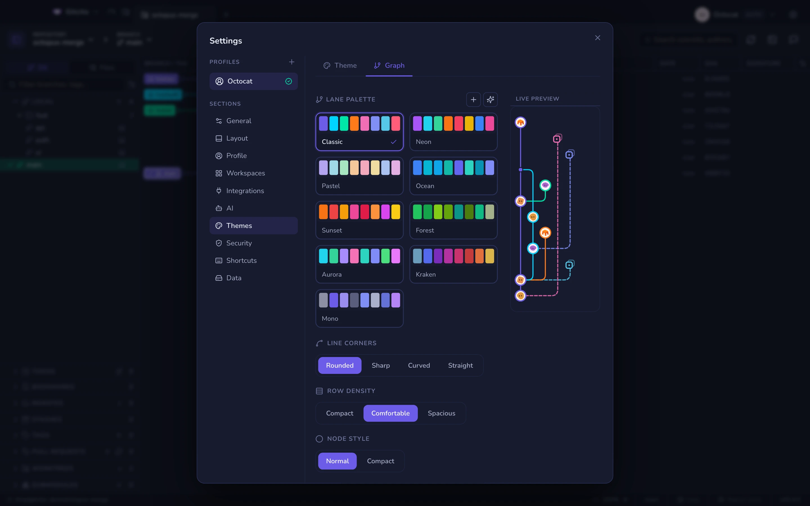
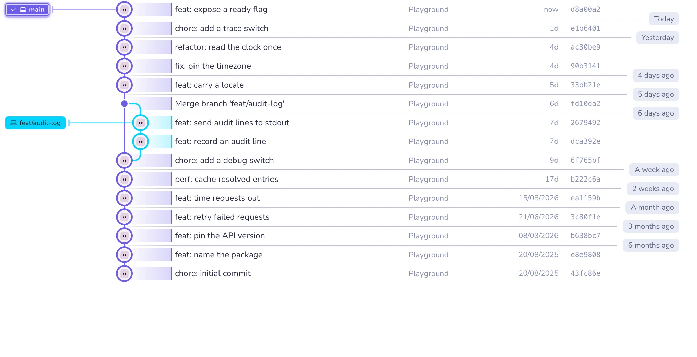
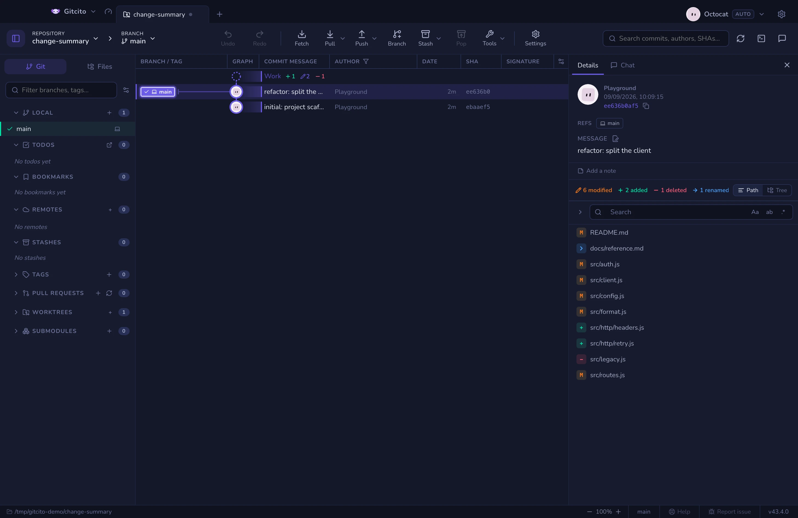

# Commit grafiği

Dallar, merge'ler ve ahtapot merge'leri açık ya da koyu temada düzgün biçimde
çizilir. Çizim pencerelenmiştir; yüz bin commit'lik bir depo, yüz commit'lik bir
depo gibi kayar.

| | |
|---|---|
|  |  |

## Gezinme

- <kbd>↑</kbd> <kbd>↓</kbd> (veya <kbd>j</kbd> <kbd>k</kbd>) seçimi ilerletir.
- <kbd>⌘</kbd>/<kbd>Ctrl</kbd> ile tıklamak bir commit'i **çoklu seçime** ekler
  ya da çıkarır; <kbd>⇧</kbd> ile tıklamak bir aralık alır. Birkaçı seçiliyken
  sağ tıklayarak onları geçerli dala cherry-pick edebilir, bitişik bir diziyi
  squash edebilir, tek bir birleşik yama dışa aktarabilir veya SHA'larını
  kopyalayabilirsiniz.
- **Son fetch ya da pull** işleminizle gelen commit'ler yeni olarak işaretlenir.
  Henüz aktif dala girmemiş olanlar, bir pull onları getirene kadar hafifçe
  saydam kalır.
- Bir commit'e sağ tıklamak **Düzelt**, **Geri al**, **Commit’e sıfırla…** ve
  **GitHub’da görüntüle** ile birlikte checkout, cherry-pick, revert, dal,
  etiket ve kopyalama sunar. Güvenli olmayan eylemler görünür kalır ve devre
  dışı olur.

## İstediğinizi göstermesi

- **Grafik odağı**, geçmişin ne kadarının çizileceğini belirler — Ayarlar →
  Temalar → **Grafik** ya da grafik başlığındaki dişli menüsü. *Her şey* hepsini
  çizer; *Doğrusal geçmiş* (ilk üst commit) yalnızca gövdeyi bırakır;
  *Birleştirilmiş dalları gizle* gövdeyi ve henüz birleştirilmemiş dalları tutar;
  *Solo mod* kendi dalını, yıldızladığın dalları ve varsayılan dalı tutar.

  Yalnızca günlüğün zaten yüklediğini süzer. *Birleştirilmiş dalları gizle*,
  git'in "geçerli dala zaten dahil" yanıtına güvenir; dal değiştirmek neyin
  gizlendiğini değiştirir — ve hâlâ bir etiketin ya da tanımadığı bir ref'in
  işaret ettiği her commit'i tutar, ki silinmiş bir dalın geride bıraktığı tam
  olarak budur. *Doğrusal geçmiş* ile *Solo mod* daha serttir: gizledikleri bir
  commit üzerindeki etiket ya da zula onunla birlikte gider.

- **Yola göre filtreleme**: bir dosyaya ya da klasöre sağ tıklayın → *Grafiği bu
  yola göre filtrele*, yalnızca ona dokunmuş commit'ler ışıklı kalsın.

- **Sütunlar**: dal, mesaj, yazar, tarih, SHA, imza ve dağıtım sütunlarını
  gösterin, gizleyin, yeniden boyutlandırın ve sıralayın.
- **Biçem**: Ayarlar → Temalar → **Grafik** — şerit paleti (8 hazır, özel veya
  yapay zekâ üretimi), köşe biçemi, satır yoğunluğu ve çizgi kalınlığı, canlı
  mini grafik önizlemesiyle.

## Tarih ayırıcıları

Uzun bir geçmişte gezinirken soru neredeyse hiçbir zaman bir işlemenin tam saati
değildir — onu tarih sütunu zaten söyler. Soru şudur: “kabaca neredeyim?”. Tarih
ayırıcıları buna yanıt verir: grafiği boydan boya geçen ince bir çizgi ve sağında
göreli bir etiket; geçmişin bir diliminin nerede bitip daha eskisinin nerede
başladığını işaretler.

Dilimler geriye gittikçe genişler — bugün, dün, birkaç gün, bir hafta, haftalar,
aylar, yıllar. Bütün mesele de bu: her gün değişiminde bir çizgi, hareketli bir
depoda neredeyse her işlemenin altında, sakin bir depoda ise hiçbir yerde çıkardı.

Bir ayırıcı, dilimin son satırının **altında** durur ve kapattığı dilimin adını
taşır; yani üstündeki satırları anlatır. Ekrandaki en alt satır ayırıcı almaz:
dilimi, henüz yüklenmemiş işlemelerde sürüyor olabilir.

Sınırları. İşlemeler `--date-order` ile listelenir; bu da bir birleştirmeyi
birleştirdiği işlemelerin üstüne koyar. Düştüğü dilimden daha yeni tarihli bir
satır, yeni bir dilim açmak yerine o dilime katılır — böylece ayırıcılar hep
yeniden eskiye doğru ilerler. İşlenmemiş değişiklikler satırı ile zulalar atlanır,
çünkü tarihleri geçmişteki yerleri değildir. Ve bir ayar yoktur: ayırıcılar hep
açıktır.

## Commit ayrıntıları

Bir commit'i seçmek değişen dosyalarını (ağaç ya da düz), yazarını, SHA'sını,
ortak yazarlarını ve imzasını gösterir. `#123` referansları ve `@mentions`
sunucunuza otomatik bağlanır.

Dosya listesinin üstünde bir **değişiklik özeti**, commit'i tek bir toplam yerine
türlere ayırır — *5 değiştirildi*, *1 eklendi*, *1 silindi*, ayrıca commit
içeriyorsa *yeniden adlandırıldı* ve *çakışmalı*. Her biri, alttaki satırlardaki
durum simgesiyle ve katlanmış klasörlerdeki sayaçlarla aynı rengi taşır; böylece
aynı renk panelin her yerinde aynı şeyi ifade eder. Dosyası olmayan türler
tamamen atlanır, bu yüzden sıradan bir düzenleme beş değil tek bir öğe gösterir.
Sade "*n* değişen dosya" toplamı için özetin üzerine gelin.

Bilerek söylemediği iki şey var. **Satırları değil dosyaları** sayar: tek
karakterlik bir düzeltme de baştan yazma da *1 değiştirildi* olarak okunur;
değişimin boyutunu ancak diff gösterir. Ve etkin bir filtreye ya da aramaya uyan
alt kümeyi değil, commit'teki her dosyayı sayar.

Aynı özet, hazırlama panelinin ve bir zulanın dosya listesinin başında da yer alır.
Hazırlama panelinde izlenmeyen dosyalar ekleme sayılır, yani *eklendi* "zaten
hazırlanmış" değil, "son commit'te yoktu" anlamına gelir.

Dosya listesi alışıldık hareketlerle çoklu seçilir
(<kbd>⌘</kbd>/<kbd>Ctrl</kbd> ile tıklama, <kbd>⇧</kbd> ile tıklama,
<kbd>⇧</kbd>+<kbd>↑</kbd>/<kbd>↓</kbd>). Seçime sağ tıklayın → *{n} dosyayı
çalışma ağacına geri yükle* o dosyaları tam bu commit'teki hâlleriyle alır: tek
bir onaydan sonra çalışma kopyalarının üzerine yazar; HEAD'e de indekse de
dokunmaz.

**Ayrıca bakınız:** [Blame ve dosya geçmişi](blame.md) · [Arama](search.md) · [Zaman makinesi](time-machine.md)
